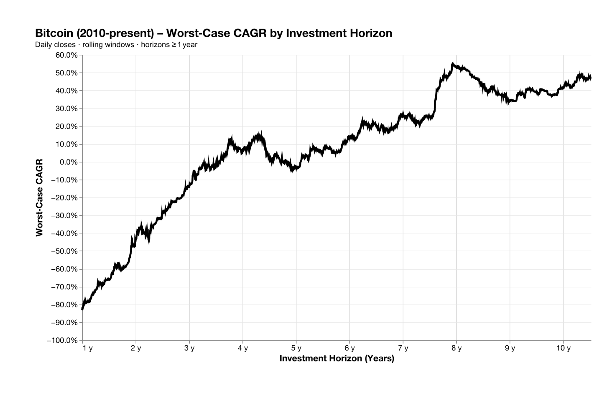
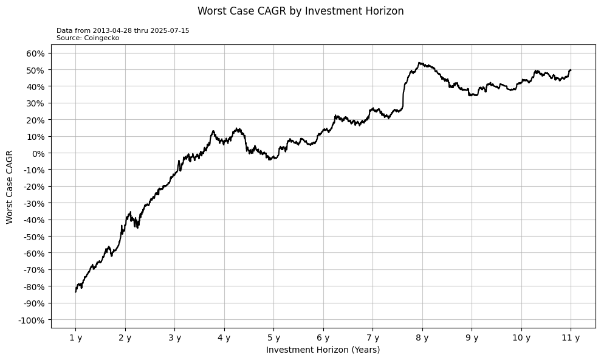
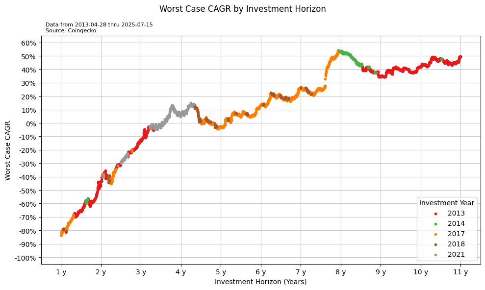

+++
date = '2025-07-17T15:27:27-04:00'
draft = true
title = 'Worst Case Cagr'
tags = 'bitcoin' 'replicate'
+++

## Motivation
On July 15, 2025, Pierre Rochard posted this on X:
https://x.com/BitcoinPierre/status/1945147693308711299

Slick chart. Novel story. Tremendous interpretation.  But is it true?

I am going to replicate the chart to:
1. Convince myself the chart is correct
2. Hone my data nerd skills
3. Reveal the methodology and data sources so anyone can corroborate 

## Understanding the raw data need
Each data point in the chart consists of:
1. an investment horizon, $h$
2. the worst case CAGR at that investment horizon

We deduce from the range of the $x$-axis that $1 \le h < 11$.

We deduce from the annotation of "Daily closes" and from noting the jaggedness of the line that $h$ increments in day-sized steps.

If we let $H$ be the number of investment horizons we wish to consider then that means the chart consists of the following $H \times 2$ dataset:

| horizon | min_cagr | 
| :-: | :-: |
| 1.0000 | -83.64 | 
| 1.0027 | -83.53 |
| 1.0054 | -83.47 |
| ... | ... |
| 11.0000 | 49.34 |

Note the $h$ values increment by 0.0027.  That's the decimal approximation of 1 day denominated in years.  ie, $\frac{1}{365} = 0.0027$.

To arrive at a minimum $CAGR$ value for a particular $h$, we need to consider all the possible $CAGR$ values for that particular $h$.  That means we need to know the start dates of every $h$-sized horizon.

If we let $D_h$ be the number of start dates for an $h$-sized horizon then we need a $D_h \times 2$ dataset.  For $h = 1$, the dataset is:
| start_date | cagr |
| :-:  | :-: |
| 2013-04-28  |  2.23 |
| 2013-04-29  |  2.07 |
| 2013-04-30  |  2.27 |
| ... | ... |
| 2024-07-16  |  0.84 |

Unfortunately, we're not given the $CAGR$ values so we need to calculate them from the raw data.  

The calculation for $CAGR$ is:
$$CAGR = - 1 + \left(\frac{\text{price at end of horizon}}{\text{price at start of horizon}}\right)^{\frac{1}{\text{\# of years in horizon}}} $$

This means if we can get the following $D_h \times 4$ dataset then we can derive everything we need (for this one particular horizon, remember):

| start_date | start_price | end_date | end_price | 
| :-:  | :-: | :-: | :-: | 
| 2013-04-28 | 135.3  | 2014-04-27 | 437.92 | 
| 2013-04-29 | 141.96 | 2014-04-28 | 436.92 | 
| 2013-04-30 | 135.3  | 2014-04-29 | 443.27 | 
| ... | ... | ... | ... | ... | 
| 2024-07-16 | 64835.48 | 2025-07-15 | 119833.67 | 

And to populate the above table, all we need is the (closing) price on each day:

| date | price |
| :-: | :-: |
| 2013-04-28 | 135.3 |
| 2013-04-29 | 141.96 |
| 2013-04-30 | 135.3 |
| ... | ... |
| 2025-07-15 | 119833.67 |

Now all we have to do is to repeat this for every $h$ value we wish to consider.  

The good news is that the raw data shown above for the $h = 1$ case will cover all other cases.  (Why?  Because the $h = 1$ case is the smallest horizon, thus requiring the most dates.  All other horizons will necessarily need less dates and all of their dates are already encompassed in the $h = 1$ case.)

It turns out we need an embarrassingly basic set of data.  Easy, peasy.  What could possibly go wrong?

## Raw data source
It turns out getting daily USD prices for bitcoin isn't straight forward.

One can find daily USD prices from several sources ([CoinGecko](https://www.coingecko.com/en/coins/bitcoin/), [CoinMarketCap](https://coinmarketcap.com/currencies/bitcoin/), [the Federal Reserve](https://fred.stlouisfed.org/series/CBBTCUSD), [Yahoo! Finance](https://finance.yahoo.com/quote/BTC-USD/history/), [Kaggle via Investing.com](https://www.kaggle.com/datasets/shiivvvaam/bitcoin-historical-data), etc.).  But they all vary in data frequency, duration, and even value. Most start around 2013...but Pierre's data starts in 2010.

Ultimately, I chose to use CoinGecko's data, even though theirs starts in 2013.

Why?

Because running the analysis with just that data was enough to convince me the chart is accurate.

## Side-by-side
The original on the left, the replicated on the right:

  
  

## Assessment
Obviously not an identical copy, but that's a mighty fine resemblance.  

All the ups and downs are happening at the same time and at nearly the identical value.  The only notable differences are with styling and the politeness of decimal places.

## Added flair
What if we added a visual dimension to convey *when* the worst case CAGR occurred?

  
  

(Nerd note: to accommodate the coloring of individual data points, the chart type was changed from line to scatter...hence, a gap in data at $h \approx 7.6$. Yes, there's a gap but it's not due to missing data.  It's due to the fact that a scatter plot does not artificially connect consecutive data points like a line plot does.)

## Worst-case CAGR timing observations
Most notably, there are only 5 years in which the worst case CAGR occurred:
- 2013
- 2014
- 2017
- 2018
- 2021

Interestingly, the lion's share of the worst case CAGR values occurred in the years following a halving:  2013, 2017, and 2021.

It makes sense that the right tail is dominated by the earliest years since there isn't much competition for the minimum.  The time horizons are large and bitcoin is relatively new.

## Ideas for further exploration
1. Animate the worst case chart to see how it changes/grows over time.
2. Add an indication of the distribution of CAGR values per horizon (at least the median).
3. Find a source that has daily OHLC data to see the worst of the worst case CAGR scenarios...ie, you buy at the day's high (as opposed to the day's close).
4. Use the same, exact source data Pierre did.

Idea #1 seems the coolest and has a high potential to reveal something static snapshots can't.

Idea #3 should probably be prioritized.  It addresses the concern of "worst case" not really being the worst case since we're buying at the close price.  Buying at the day's high is actual the worst case.

Idea #2 starts to breach the scope of the original analysis.

Idea #4 is sound but its benefit is questionable in a world of scarce resources.